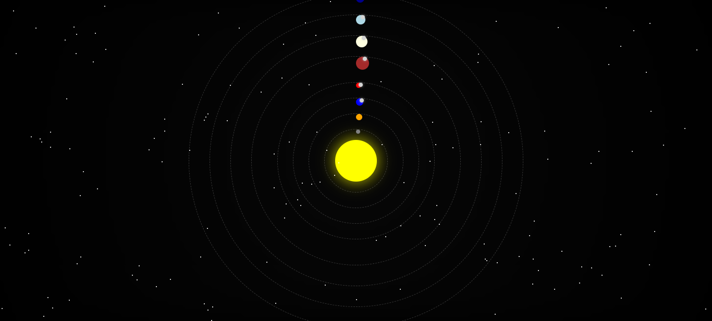

# Solar System Animation with Planets, Moons, and Meteors

This project creates a visual representation of the solar system with the Sun at the center, planets orbiting around it, moons orbiting the planets that have them, and falling meteors in the background. The animation includes effects like the Milky Way and twinkling stars to create a more immersive experience.

## Features
- **Orbiting Planets**: Each planet orbits around the Sun at different speeds.
- **Moons**: Planets like Earth, Mars, Jupiter, Saturn, and Uranus have moons orbiting them.
- **Falling Meteors**: Random meteors fall from the top of the screen to create a dynamic effect.
- **Milky Way Effect**: A rotating Milky Way background adds to the celestial atmosphere.
- **Twinkling Stars**: Random stars twinkle in the background to simulate a starry sky.

## Installation

1. **Clone or Download the Repository**:
   You can clone this repository using Git:
   ```bash
   git clone https://github.com/aleaengineer/solar-system-animation.git
   ```
   Or simply download the files as a ZIP.

2. **Open the HTML file**:
   After downloading the files, open the `index.html` file in your web browser to view the animation.

## How It Works

- **HTML**: The HTML structure includes a Sun, planets with respective orbits, and moons that orbit their planets.
- **CSS**: CSS styles are used to position and animate the planets, moons, and meteors. Keyframe animations control the orbits and motion.
- **JavaScript**: JavaScript is used to generate random stars and meteors in the background, adding to the dynamic nature of the animation.

## Key Sections of the Code

- **Milky Way Animation**: The background rotates slowly to simulate the movement of the galaxy.
- **Planet and Moon Orbits**: Each planet orbits around the Sun with a unique speed. Moons orbit their respective planets.
- **Meteor Effect**: Meteors are randomly generated and animated to fall across the screen.

## Demo

You can view a demo of this animation in your browser by opening the `index.html` file.

## Screenshots


## Future Improvements

- **Add more moons**: Planets like Saturn, Uranus, and Jupiter can have additional moons.
- **Improve meteor animation**: More complex meteor trails and randomization.
- **Add more celestial objects**: Include dwarf planets, comets, or asteroid belts.

## License

This project is open-source and available under the [MIT License](LICENSE).
```

### Penjelasan:

1. **Features**: Menyediakan gambaran umum dari semua fitur animasi yang ada di proyek.
2. **Installation**: Memberikan instruksi untuk meng-clone atau mendownload dan membuka file di browser.
3. **How It Works**: Menjelaskan bagaimana struktur HTML, CSS, dan JavaScript bekerja untuk menciptakan animasi ini.
4. **Key Sections of the Code**: Menyebutkan bagian-bagian penting dari kode yang membuat efek-efek animasi berfungsi.
5. **Demo**: Menyediakan instruksi untuk melihat demo animasi.
6. **Screenshots**: (Opsional) Menyediakan screenshot dari animasi jika diperlukan.
7. **Future Improvements**: Ide-ide untuk pengembangan lebih lanjut pada proyek ini.
8. **License**: Informasi lisensi jika proyek ini dihosting atau dibagikan.

Anda dapat menyesuaikan bagian-bagian tertentu sesuai dengan preferensi atau perubahan lebih lanjut pada proyek Anda.
